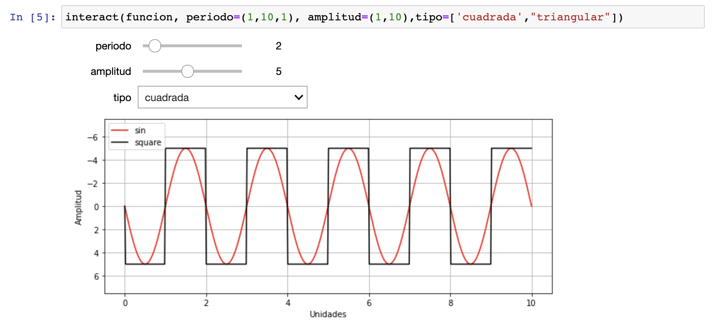
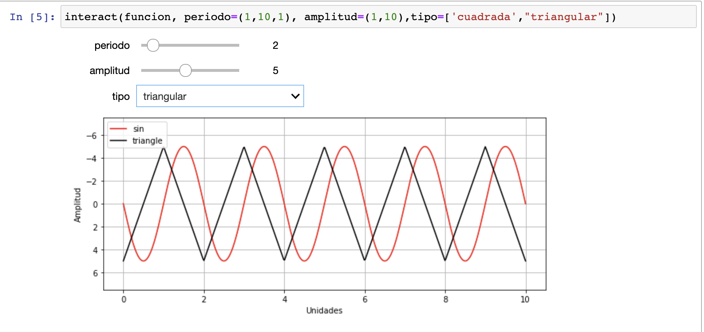

# Tarea: Onda Interactiva

Realiza una gráfica usando  interact, numpy y matplotlib que grafique una onda sinusoidal y te permita seleccionar  una onda cuadrada o una onda triangular y las grafique.

En la interacción se debe poder definir el periodo entre 1 a 10 y la amplitud de 1 a 10, ambas con un paso de 1.

La visualización se debe hacer con para el eje x debe ir de 0 a 10, 
para el eje y de 0 a 1.5*Amplitud, como se muestra en las dos siguientes figuras:

La gráfica interactiva se debe colocar en el folder notebooks, en la libreta grafica_interactiva que se encuentra vacia.

Este ejercicio vale 48  puntos, que se asignaran:

* 10 puntos: gráfica del sin

* 15 puntos: gráfica cuadrada

* 15 puntos: gráfica triangular

*  5 puntos: etiquetas en $x$ y $y$
*  3 puntos: etiquetas para las gráficas (1 por tipo de gráfica)
*  3 puntos: etiquetas para las gráficas (1 por tipo de gráfica)

Puedes revisar [esta](https://en.wikipedia.org/wiki/Square_wave#:~:text=A%20square%20wave%20is%20a,minimum%20and%20maximum%20are%20instantaneous.) liga para revisar la teoría de las gráficas.